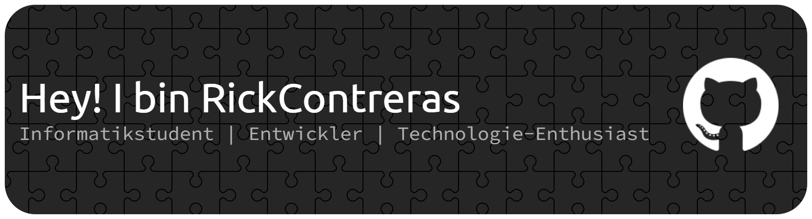

  <a href="README.md">English</a> |
  <a href="README.es.md">Español</a> |
  <a href="README.de.md">Deutsch</a>

## Über mich 🚀

Ich bin ein Informatikstudent, der sich für Technologie und Softwareentwicklung begeistert. Mein Ziel ist es, der bestmögliche Ingenieur zu werden und ein breites Spektrum an Wissen in meinem Bereich zu beherrschen. Ich liebe es zu lernen und bin ständig auf der Suche nach neuen Fähigkeiten und Wissen, die ich meinem Arsenal hinzufügen kann.

- 🌱 Derzeit lerne ich **React** und andere Technologien.
- 👯 Ich suche nach Möglichkeiten, an **Open-Source-Projekten** mitzuwirken oder neue Dinge zu lernen.
- 💬 Frag mich über **Programmierung, Algorithmen, Webentwicklung, maschinelles Lernen (ML) und/oder künstliche Intelligenz**.

## Technologien & Werkzeuge 🛠️

### Frontend

### Backend

### Machine Learning

### DevOps & Werkzeuge

### Andere

## GitHub-Statistiken 📊

  <!---->
  
  
  <!---->

## Zertifizierungen & Erfolge 🏆

- 🏅 **Hervorragender fortgeschrittener Student** - Universidad de Antioquia (2025)
- 📜 **GitHub Actions** - Github (2025)
- 📜 **GitHub Foundations** - Github (2024)

## 🌐 Verbinde dich mit mir

- [LinkedIn](https://www.linkedin.com/in/rickcontrerasg/)

---

